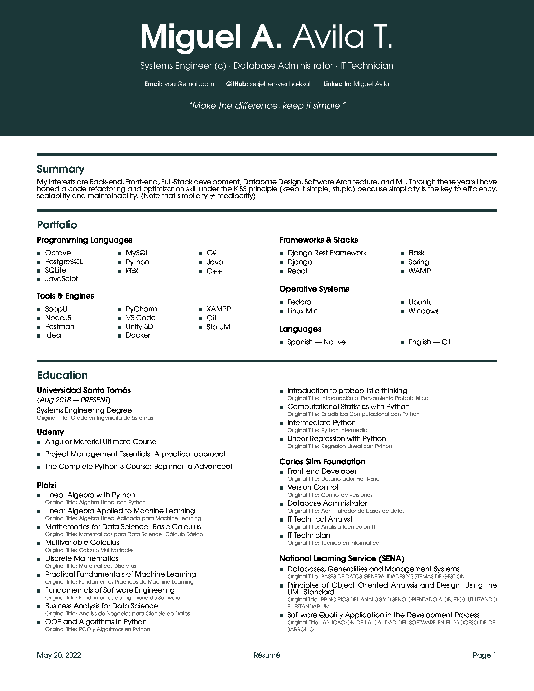
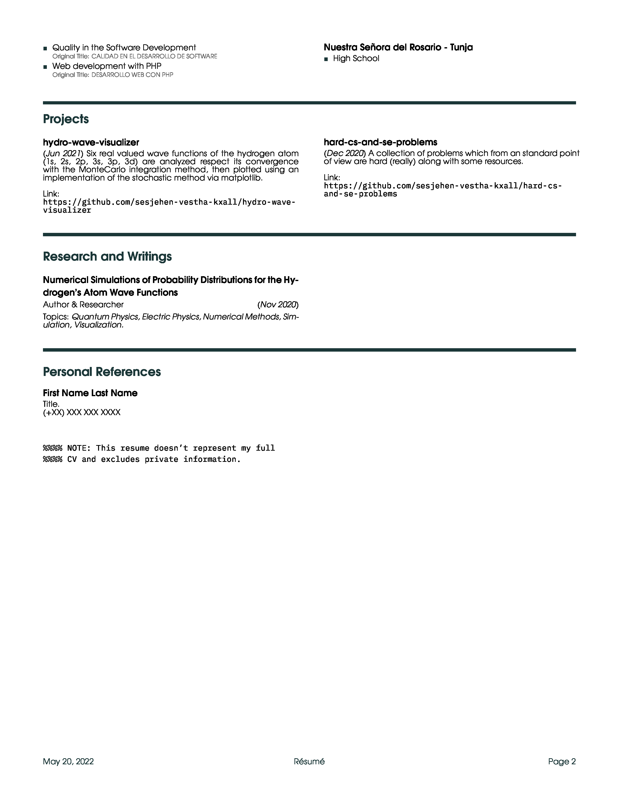
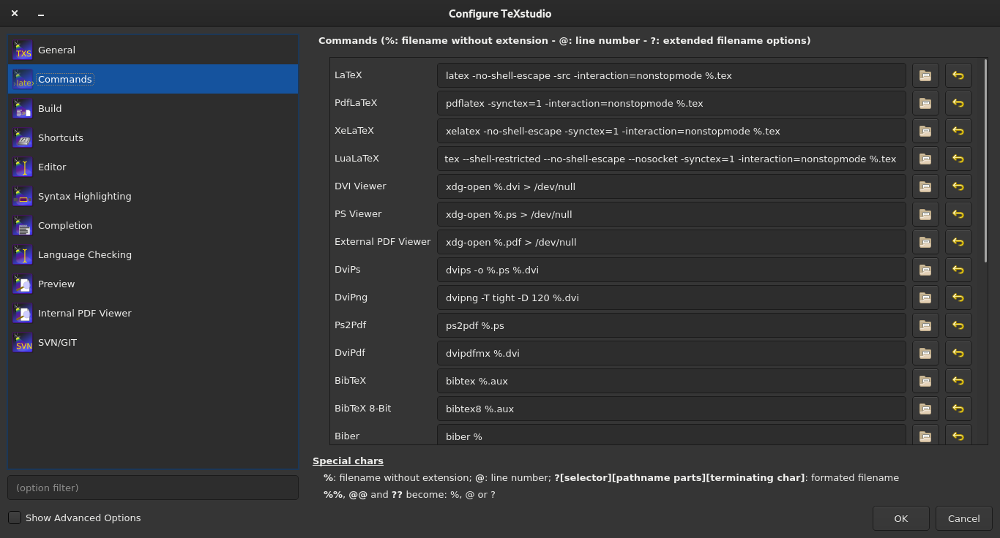

# identity-cv

## Description
An elegant curriculum vitae template made in  latex with beautiful opensource fonts.

## Sample Screenshots

**You can also see a sample resume in the `sample-file` directory**

<p align="center">
    
</p>

<p align="center">
    
</p>

## Compiling With XeLaTeX or LuaLaTeX
As a security measue, it's better to disable shell scape and networking
when using an engine as Xe(La)TeX or Lua(La)TeX. With that in mind:

It's recommended to compile with Xe(La)TeX using

    xelatex -no-shell-escape -synctex=1 -interaction=nonstopmode <file-name>.tex

If you prefeer Lua(La)Tex then it's recommended to run

    lualatex --shell-restricted --no-shell-escape --nosocket -synctex=1 -interaction=nonstopmode <file-name>.tex

### To use these settings in texstudio:

<p align="center">
    
</p>

## Converting your resume to a jpeg with ImageMagick

```shell
$ convert -density 300 resume.pdf -quality 100 resume.jpeg
```

Note: It works for png and other formats,
for further knoledge read about ImageMagick